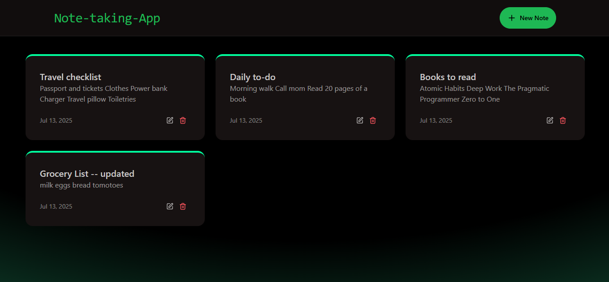
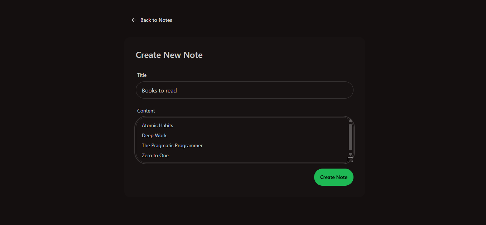
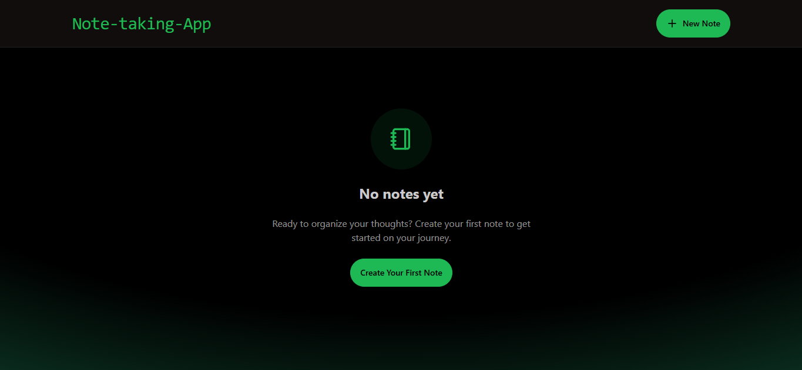

# 📝 Notes Taking Application

A full-stack Notes Taking App built using **MERN Stack** (MongoDB, Express, React, Node.js) that allows users to create, view, and manage notes efficiently with proper rate limiting and a clean UI.

🚀 [Live Demo](https://notes-taking-application-73mq.onrender.com)

---

## 📂 Project Structure

```
NOTE-TAKING-APP/
├── backend/
│   ├── config/
│   │   ├── db.js
│   │   └── upstash.js
│   ├── controllers/
│   │   └── notesController.js
│   ├── middleware/
│   │   └── rateLimiter.js
│   ├── models/
│   │   └── Note.js
│   ├── routes/
│   │   └── notesRoutes.js
│   ├── .env
│   └── server.js
├── frontend/
│   ├── public/
│   ├── src/
│   │   ├── components/
│   │   │   ├── Navbar.jsx
│   │   │   ├── NoteCard.jsx
│   │   │   ├── NotesNotFound.jsx
│   │   │   └── RateLimitedUI.jsx
│   │   ├── lib/
│   │   │   ├── axios.js
│   │   │   └── utils.js
│   │   ├── pages/
│   │   │   ├── CreatePage.jsx
│   │   │   ├── HomePage.jsx
│   │   │   ├── NoteDetailPage.jsx
│   │   │   └── App.jsx
│   │   └── index.css
│   ├── index.html
│   └── vite.config.js
```

---

## ⚙️ Tech Stack

**Frontend:**
- React
- Vite
- Axios
- Tailwind CSS / CSS

**Backend:**
- Node.js
- Express
- MongoDB
- Upstash (Rate Limiting)
- Mongoose

**Deployment:**
- Render (for both frontend and backend)
- MongoDB Atlas (cloud database)

---

## 🔐 Features

- 📝 Create, Read, View Notes
- 🚫 Rate Limiting for API Protection
- ⚠️ 404 and Rate Limit UI Handling
- 🔗 REST API Integration
- 🎨 Responsive UI with Components
- 🌐 Deployed & Hosted with Render

---

## 🚀 Getting Started

### Prerequisites

- Node.js v16+
- npm
- MongoDB Atlas URI
- Upstash Rate Limit Token

### 1. Clone the Repo

```bash
git clone https://github.com/iamNandini19/note-taking-app.git
cd note-taking-app
```

---

### 2. Backend Setup

```bash
cd backend
npm install
```

Create a `.env` file:

```env
PORT=5000
MONGODB_URI=your_mongodb_uri
RATE_LIMIT_REDIS_URL=your_upstash_url
RATE_LIMIT_REDIS_TOKEN=your_upstash_token
```

Start server:

```bash
npm run dev
```

---

### 3. Frontend Setup

```bash
cd ../frontend
npm install
npm run dev
```

---

## 🧪 API Endpoints

| Method | Endpoint           | Description            |
|--------|--------------------|------------------------|
| GET    | `/api/notes`       | Get all notes          |
| POST   | `/api/notes`       | Create a new note      |
| GET    | `/api/notes/:id`   | Get note by ID         |
| DELETE | `/api/notes/:id`   | Delete note by ID      |

> ⚠️ All routes are rate-limited using Upstash Redis.

---

## 🖼️ Screenshots

### 🏠 Home Page
This is the main landing page where all the saved notes are listed. It gives an overview of available notes with options to view or delete each note.



---

### ✍️ Create Note Page
This page allows users to create a new note by entering the title and content. Once submitted, the note is stored in the backend and visible on the home page.



---

### 🔄 Update Note Page
This interface is used to update an existing note. It pre-fills the current content, allowing users to make changes and save updates.


---

### ⚠️ No Notes Found Page
This screen appears when there are no notes available in the system. It helps in clearly communicating the empty state to users.




---

## 🧠 Folder Breakdown

### Backend
- **config/**: Database and rate limit configurations
- **controllers/**: Logic for note operations
- **middleware/**: Rate limiting middleware
- **models/**: Mongoose Note schema
- **routes/**: API route definitions

### Frontend
- **components/**: UI components (NavBar, Cards, etc.)
- **pages/**: Page views (Home, Create, Detail)
- **lib/**: Axios instance and utilities

---

## 📦 Deployment

This app is deployed on **Render**:

🔗 [Live Link](https://notes-taking-application-73mq.onrender.com)

---

## 📄 License

This project is licensed under the [MIT License](LICENSE).

---

## 🙌 Acknowledgments

- [MongoDB Atlas](https://www.mongodb.com/cloud/atlas)
- [Upstash](https://upstash.com/)
- [Render](https://render.com/)
- [Vite](https://vitejs.dev/)

---

## 👨‍💻 Author

Made with ❤️ by [Nandini Mamillapalli]
